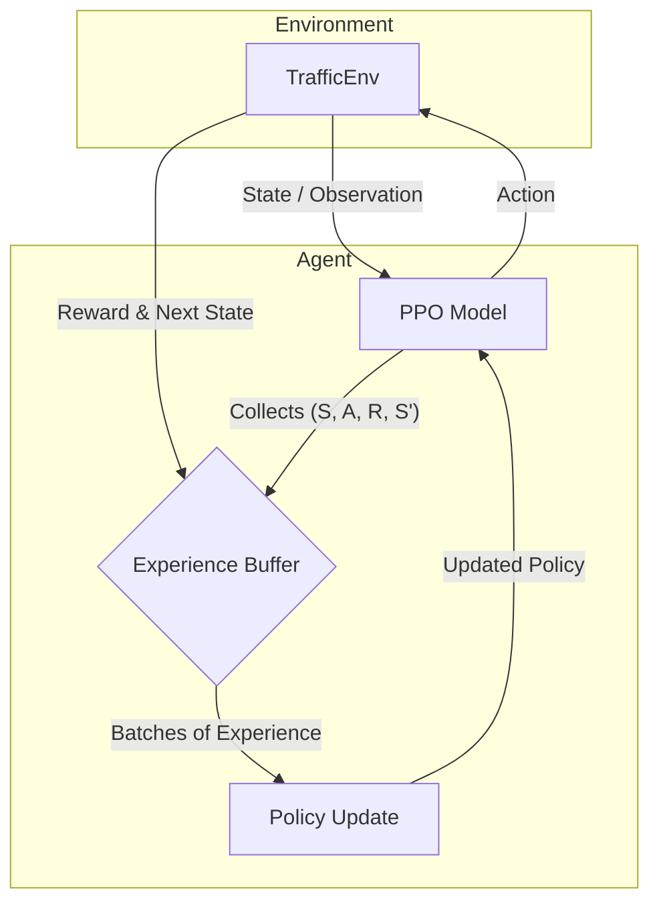
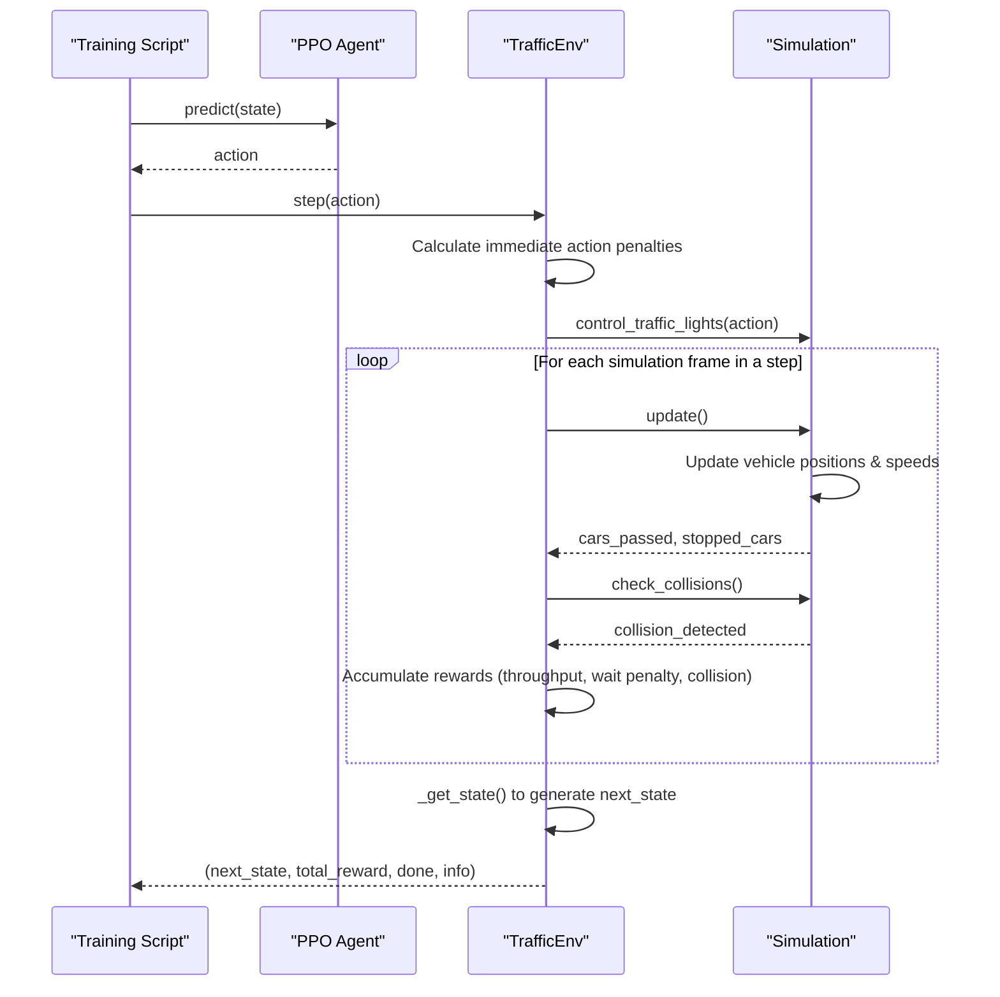

# Reinforcement Learning for Traffic Light Control


This project implements a Deep Reinforcement Learning agent based on the Proximal Policy Optimization (PPO) algorithm to intelligently control a traffic light at a four-way intersection. The agent is trained in a custom `gymnasium` environment with a Pygame-based simulation for visualization. The goal is to minimize vehicle wait times and maximize traffic throughput, outperforming a traditional fixed-timer system.

---

## 📋 Table of Contents

- [Features](#-features)
- [Project Structure](#-project-structure)
- [System Architecture & Flow](#-system-architecture--flow)
  - [RL Training Loop Dataflow](#rl-training-loop-dataflow)
  - [Agent-Environment Interaction Sequence](#agent-environment-interaction-sequence)
- [The Reinforcement Learning Environment](#-the-reinforcement-learning-environment)
  - [Observation Space](#observation-space)
  - [Action Space](#action-space)
  - [Reward Function](#reward-function)
- [Installation](#-installation)
- [Usage](#-usage)
  - [1. Training the Agent](#1-training-the-agent)
  - [2. Evaluating the Agent](#2-evaluating-the-agent)
  - [3. Running a Visual Test](#3-running-a-visual-test)
  - [4. Hyperparameter Tuning](#4-hyperparameter-tuning)
  - [5. Manual Control](#5-manual-control)

---

## ✨ Features

*   **PPO Agent**: Utilizes the high-performance Proximal Policy Optimization (PPO) algorithm from `stable-baselines3`.
*   **Custom Environment**: A fully-featured `gymnasium` environment built from scratch to model the traffic intersection.
*   **Pygame Visualization**: A dynamic and intuitive visual interface to observe the simulation and the agent's performance in real-time.
*   **Curriculum Learning**: The agent is trained across a curriculum of increasingly difficult scenarios (normal, rush hour, unbalanced traffic) to improve generalization and robustness.
*   **Quantitative Evaluation**: A comprehensive evaluation suite to benchmark the RL agent against a baseline `TimerAgent` across various traffic conditions.
*   **Hyperparameter Tuning**: Includes a script using `optuna` to systematically find the best hyperparameters for the PPO model.
*   **Manual Control**: A mode to manually control the traffic lights, providing a human benchmark and a way to interact with the simulation.

---

## 📁 Project Structure

```
.
├── agent.py               # Defines the TrafficAgent class for training and testing.
├── constants.py           # Global constants for simulation, colors, and RL.
├── environment.py         # The custom Gymnasium environment (TrafficEnv).
├── evaluation.py          # Functions for evaluating agents and the TimerAgent baseline.
├── gui.py                 # Pygame-based GUI for rendering the simulation.
├── main.py                # Main script for training and evaluating the RL agent.
├── manual_control.py      # Script to run the simulation with manual keyboard control.
├── simulation.py          # Core simulation logic (vehicle spawning, movement, collisions).
├── test.py                # Script for running a quick visual test of the best agent.
├── tuning.py              # Hyperparameter tuning script using Optuna.
├── vehicle.py             # Defines the Vehicle class.
├── road.py                # Defines the Lane class.
├── traffic_light.py       # Defines the TrafficLight class.
├── models/                # Directory to save trained model checkpoints.
├── logs/                  # Directory for TensorBoard logs.
└── requirements.txt       # Python dependencies.
```

---

## 🏗️ System Architecture & Flow

### RL Training Loop Dataflow

This diagram illustrates the flow of information between the Agent and the Environment during the training process.



### Agent-Environment Interaction Sequence

This diagram shows the detailed sequence of calls for a single `env.step()` action, from the agent's decision to the simulation's update and the final reward calculation.



---

## 🤖 The Reinforcement Learning Environment

The core of this project is the custom `TrafficEnv`. Here's a breakdown of its components:

### Observation Space

The agent receives a state vector with 18 continuous values that describe the current state of the intersection.

| Index(es) | Description                                                              | Range         |
| :-------- | :----------------------------------------------------------------------- | :------------ |
| `0-7`     | **Time-To-Intersection (TTI)**: TTI for the 2 closest cars from N, S, E, W | `[0, 60]`     |
| `8-11`    | **Queue Length**: Number of stopped cars for each direction (N, S, E, W)   | `[0, 50]`     |
| `12`      | **Current Phase**: `0` for NS-green, `1` for EW-green                      | `{0, 1}`      |
| `13`      | **Time in Current Phase**: Number of steps elapsed in the current phase    | `[0, 1800]`   |
| `14-17`   | **Intersection Occupancy**: Binary flag if a car is in the intersection    | `{0, 1}`      |

### Action Space

The agent has a discrete action space with two possible actions.

| Action | Description                      |
| :----- | :------------------------------- |
| `0`    | **Keep**: Keep the current light phase. |
| `1`    | **Switch**: Switch to the next light phase. |

### Reward Function

The reward function is carefully designed to guide the agent toward the desired behavior. It is calculated at each step:

*   **✅ Throughput Bonus (`+300`)**: A large positive reward for each car that successfully passes through the intersection.
*   **❌ Waiting Penalty (Non-linear)**: A penalty that grows quadratically with the time each car waits. This heavily punishes long queues and gridlock.
*   **❌ Collision Penalty (`-5000`)**: An extremely large negative penalty for any collision, making safety the top priority.
*   **❌ Unsafe Switching Penalty (`-100`)**: A penalty for switching the light while cars from the currently green direction are still in the intersection.
*   **❌ Action Penalty (`-1`)**: A small negative penalty every time the agent switches the light to discourage frantic, unnecessary switching.

---

## 🔧 Installation

1.  **Clone the repository:**
    ```bash
    git clone https://github.com/your-username/RL-Traffic-Control.git
    cd RL-Traffic-Control
    ```

2.  **Create a virtual environment (recommended):**
    ```bash
    python -m venv venv
    source venv/bin/activate  # On Windows, use `venv\Scripts\activate`
    ```

3.  **Install the dependencies:**
    ```bash
    pip install -r requirements.txt
    ```

---

## 🚀 Usage

### 1. Training the Agent

The training process uses a curriculum defined in `main.py`. To start training from scratch, set `TRAIN_MODEL = True` in `main.py` and run:

```bash
python main.py
```

*   Training can take a significant amount of time.
*   The best model from each stage is saved in the `/models` directory (e.g., `models/ppo_stage1_normal_best/best_model.zip`).
*   Progress can be monitored using TensorBoard: `tensorboard --logdir logs`.

### 2. Evaluating the Agent

After training, you can evaluate the final model's performance against the baseline. Set `TRAIN_MODEL = False` and `EVALUATE_MODEL = True` in `main.py` and run:

```bash
python main.py
```

This will run the best-trained agent and the `TimerAgent` on multiple test scenarios and print a comparative report to the console.

### 3. Running a Visual Test

To watch your best-trained agent in action, run the test script:

```bash
python test.py
```

This will launch a Pygame window showing the agent controlling traffic in a rush-hour scenario.

### 4. Hyperparameter Tuning

To find optimal hyperparameters for the PPO agent, you can run the tuning script. This will take a long time but can yield significant performance improvements.

```bash
python tuning.py
```

The script will print the best combination of hyperparameters found at the end of the study. These can then be updated in the `BEST_PARAMS` dictionary in `main.py`.

### 5. Manual Control

To try controlling the traffic light yourself, run the manual control script.

```bash
python manual_control.py
```

*   Press **ENTER** to switch the traffic lights.
*   Close the window to exit.